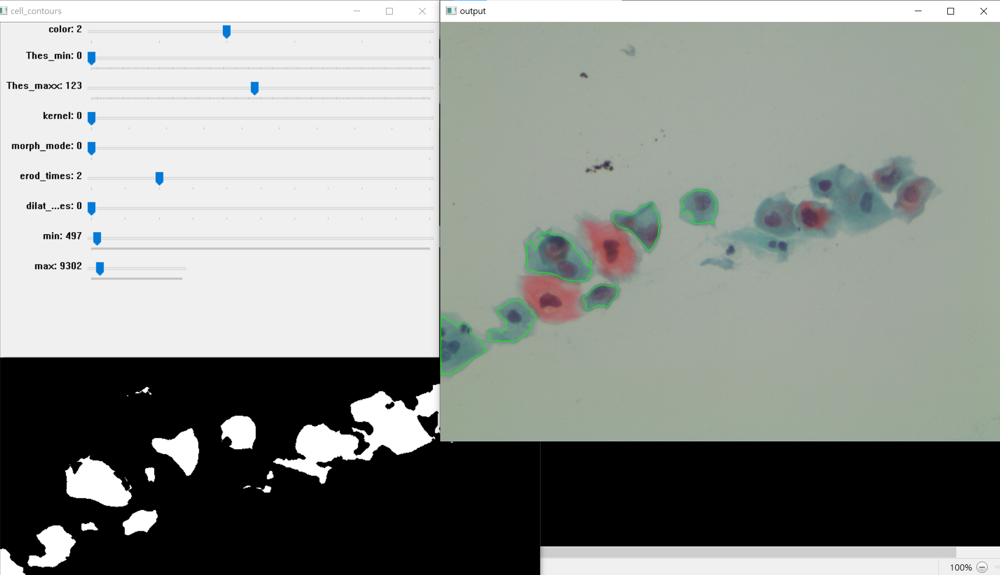
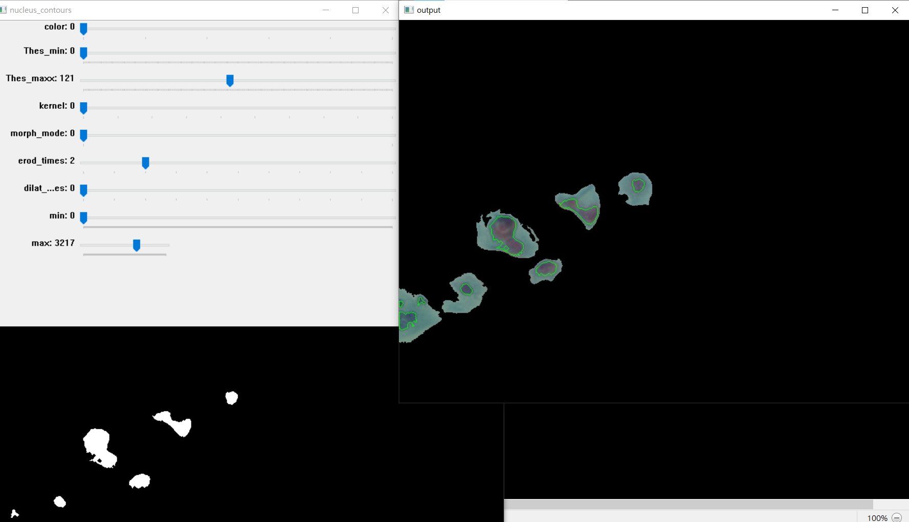
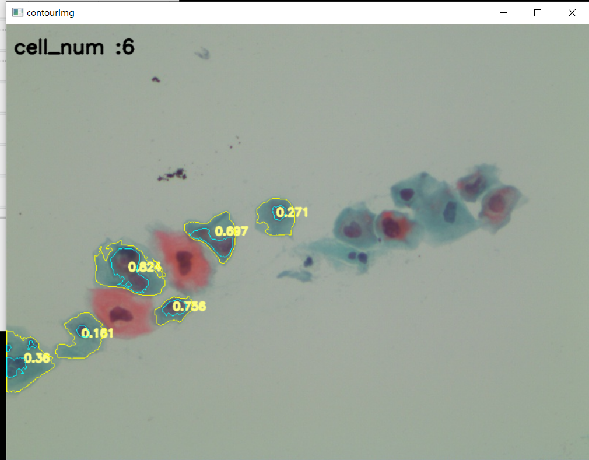

## 使用步驟
* <b>執行 set.py</b>
```python
$ python set.py
```

* <b>抓取細胞輪廓</b>
藉由調整滑桿數值來抓取細胞輪廓。
(如需要抓取下一組細胞輪廓，按 <b>Enter 鍵</b>)
抓取完畢後，請按 <b>ESC鍵</b>


* <b>抓取細胞核</b>
藉由調整滑桿數值來抓取細胞核。
(如需要抓取下一組細胞輪廓，按 <b>Enter 鍵</b>)
抓取完畢後，請按 <b>ESC鍵</b>

* 儲存結果
會自動計算<b>細胞核質比</b>然後儲存在 `./result/` 資料夾內。
將上述操作的參數儲存起來，可以藉由 `show.py` 推論到其他影像上。


## 滑桿功能 :
 
<table>
    <tr>
        <th>滑桿名稱</th>
        <th>滑桿功能</th>
    </tr>
    <tr>
    	<td><b>color</b></td>
        <td>提取顏色圖層 (B、G、R、H、S、V)</td>
    </tr>
    <tr>
    	<td><b>Thes_min</b></td>
        <td>像素值最小值</td>
    </tr>
    <tr>
    	<td><b>Thex_max</b></td>
        <td>像素值最大值</td>
    </tr>
    <tr>
    	<td><b>kernel</b></td>
        <td>kernel大小  0 代表3x3 1代表5x5...</td>
    </tr>
    <tr>
    	<td><b>morph_mode/b></td>
        <td>黑白對調</td>
    </tr>
    <tr>
    	<td><b>erod_times</b></td>
        <td>侵蝕</td>
    </tr>
    <tr>
    	<td><b>dilat_times</b></td>
        <td>膨脹</td>
    </tr>
    <tr>
    	<td><b>min</b></td>
        <td>設定輪廓面積的最小值</td>
    </tr>
    <tr>
    	<td><b>max</b></td>
        <td>設定輪廓面積的最大值</td>
    </tr>
</table>

